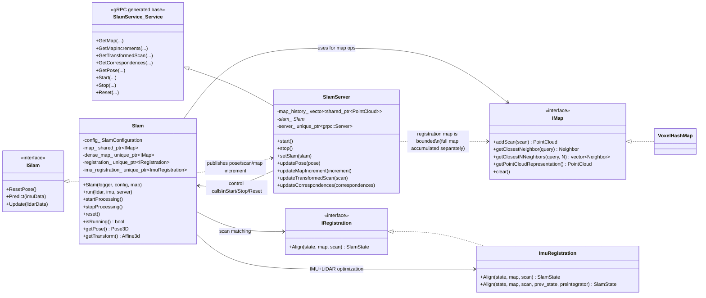

# mslam Core Class Model

This document summarizes the main runtime structure around the core
classes: `Map` (via `IMap`), `Slam`, and `SlamServer` (gRPC endpoint).

At a high level:
- `Slam` owns the SLAM state machine (predict/update/reset).
- `Slam` depends on `IMap` for map storage and nearest-neighbor queries.
- `SlamServer` exposes map/pose/controls over gRPC and delegates control
	commands (`Start`, `Stop`, `Reset`) to a bound `Slam` instance.
- `VoxelHashMap` is the concrete `IMap` implementation and is selected by
	configuration.

## Notes

- `SlamServer` is both a transport adapter (gRPC) and a live data publisher
	for pose and point-cloud streams.
- `Slam` remains the computation core and is transport-agnostic, except for
	pushing outputs to `SlamServer` during `run()`.
- The map abstraction allows switching map backends without changing the SLAM
	pipeline logic.
